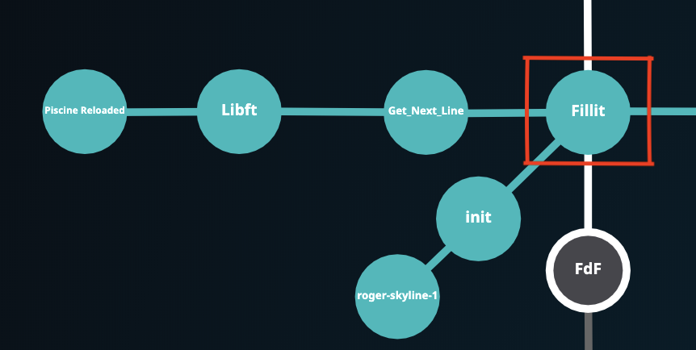
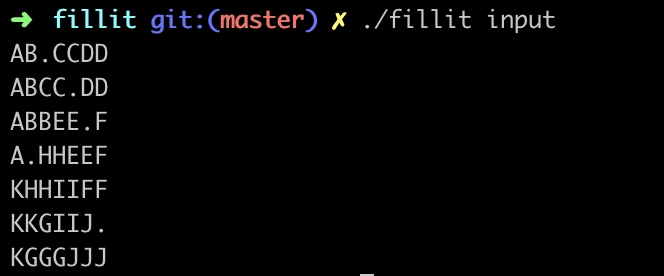

## Fillit

An algorithmic project to find the smallest square of a combination of tetriminos. Yes, tetris pieces.
The principle of this code is to place pieces one by one and backtrack each time you can't place a piece on the minimal square (size of this square function of the number of pieces in the input). If you can't place the pieces on the smallest square, increment the square size and place pieces again.
Do this until a solution is found

### How to exec: 

You will need
  - Make GNU
  - gcc
  
 usage : `./fillit test_file`
 
 Ex : 

You can edit the input file and add some tetriminos (26 max). Refer to the subject for tetriminos shapes and parsing rules.
